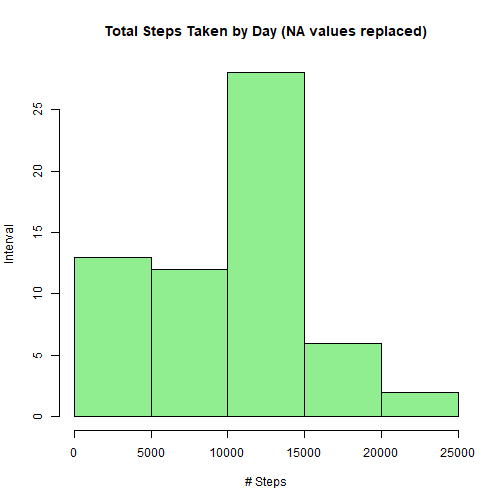

Introduction (taken from the course assignment)

It is now possible to collect a large amount of data about personal movement using activity monitoring devices such as a Fitbit, Nike Fuelband, or Jawbone Up. These type of devices are part of the “quantified self” movement - a group of enthusiasts who take measurements about themselves regularly to improve their health, to find patterns in their behavior, or because they are tech geeks. But these data remain under-utilized both because the raw data are hard to obtain and there is a lack of statistical methods and software for processing and interpreting the data.

This assignment makes use of data from a personal activity monitoring device. This device collects data at 5 minute intervals through out the day. The data consists of two months of data from an anonymous individual collected during the months of October and November, 2012 and include the number of steps taken in 5 minute intervals each day.

### Data
The data for this assignment can be downloaded from the course web site:

Dataset: Activity monitoring data [52K] The variables included in this dataset are:

- steps: Number of steps taking in a 5-minute interval (missing values are coded as NA).

- date: The date on which the measurement was taken in YYYY-MM-DD format.

- interval: Identifier for the 5-minute interval in which measurement was taken.

The dataset is stored in a comma-separated-value (CSV) file and there are a total of 17,568 observations in this dataset.

#### To load and process data the following packages need to be loaded

```r
library(knitr)
library(ggplot2)
library(chron)
```
#### These are the steps to download, unzip and read the .csv file


```r
temporary_file <- tempfile()
download.file("https://d396qusza40orc.cloudfront.net/repdata%2Fdata%2Factivity.zip", temporary_file, mode="wb")
unzip(temporary_file, "activity.csv")
activity_data <- read.csv("activity.csv")
unlink(temporary_file)
```

### Question # 1 - What is mean total number of steps taken per day?
(For this part of the assignment, you can ignore the missing values in the dataset.)

#### Question # 1 Activity # 1 - Calculate the total number of steps taken per day


```r
## Calculation of Total number of steps taken by day
steps_by_day <- aggregate(steps ~ date, data = activity_data, FUN = sum, na.rm = TRUE)
```

#### Question # 1 Activity # 2 Make a histogram of the total number of steps taken each day


```r
## Histogram of the  steps taken each day 
hist(steps_by_day$steps, 
        main = "Total Steps Taken by Day", col = "lightblue", ylab = "Interval", xlab = "# Steps", border = "black")
```


#### Question # 1 Activity # 3  - Calculate and report the mean and median total number of steps taken per day.


```r
## mean of the total steps per day (TSBD)
TSBD_mean <- mean(steps_by_day$steps)
TSBD_mean
```

```
## [1] 10766.19
```

```r
## median of the total steps per day (TSBD)
TSBD_median <- median(steps_by_day$steps)
TSBD_median
```

```
## [1] 10765
```

### Question # 2 - What is the average daily activity pattern?
        
#### Question # 2 Activity # 1 - Make a time series plot of the 5-minute interval (x-axis) and the average number of steps taken, averaged across all days (y-axis)


```r
# calculation of the average daily activity
five_minute_interval <- aggregate(steps ~ interval, activity_data, mean)
par(bg = "red")
plot(five_minute_interval$interval, five_minute_interval$steps, type = "p", xlab = "5 min. Interval",
     ylab = "# of Steps", main = "Avg. Num. of Steps by five minute interval")
```


#### Question # 2 Activity # 2 - Which 5-minute interval, on average across all the days in the dataset, contains the maximum number of steps?


```r
# calculation of the maximum number of steps
maximum_steps <- five_minute_interval[which.max(five_minute_interval$steps),1]
maximum_steps
```

```
## [1] 835
```

### Question # 3 - Imputing missing values

#### Question # 3 Activity # 1 - Calculate and report the total number of missing values in the dataset with NAs


```r
## Creating another set with missing values
activity2_data <- activity_data
# calculation of the total number of missing values
sum(is.na(activity2_data))
```

```
## [1] 2304
```
#### Question # 3 Activity # 2 and # 3 - Devise a strategy for filling in all of the missing values in the           dataset.The strategy does not need to be sophisticated. For example, you could use the mean/median for          that day, or the mean for that 5-minute interval, etc. Create a new dataset that is equal to the                original dataset but with the missing data filled in
               

```r
## Use the new created data set and replace the NA values with the result of the median calculation for the 5-minute intervals
missing_values <- is.na(activity2_data$steps)
average_interval <- tapply(activity2_data$steps, activity2_data$interval, median, 
                           na.rm=TRUE, simplify = TRUE)

activity2_data$steps[missing_values] <- average_interval[as.character(activity2_data$interval[missing_values])]

# this is to show the first set of data in the variable
head(activity2_data)
```

```
##   steps       date interval
## 1     0 2012-10-01        0
## 2     0 2012-10-01        5
## 3     0 2012-10-01       10
## 4     0 2012-10-01       15
## 5     0 2012-10-01       20
## 6     0 2012-10-01       25
```

#### Question # 3 Activity 4 - Make a histogram of the total number of steps taken each day and Calculate and      report the mean and median total number of steps taken per day. Do these values differ from the                 estimates from the first part of the assignment? 
        
        What is the impact of imputing missing data on the estimates of the total daily number of steps?
        
        The mean and median differ from the two data sets:
        
        with NA values          without NA values
        mean = 10766.19         mean = 9503.869
        median = 10765          median = 10395
        

```r
## Calculation of Total number of steps taken by day
steps_by_day_2 <- aggregate(steps ~ date, data = activity2_data, FUN = sum, na.rm = TRUE)

## Histogram of the  steps taken each day 
hist(steps_by_day_2$steps, 
        main = "Total Steps Taken by Day (NA values replaced)", col = "lightgreen", 
        ylab = "Interval", xlab = "# Steps", border = "black")
```



```r
## mean of the total steps per day (TSBD)
TSBD_mean_2 <- mean(steps_by_day_2$steps)
TSBD_mean_2
```

```
## [1] 9503.869
```

```r
## median of the total steps per day (TSBD)
TSBD_median_2 <- median(steps_by_day_2$steps)
TSBD_median_2
```

```
## [1] 10395
```

### Question # 4 - Are there differences in activity patterns between weekdays and weekends?


#### Question # 4 Activity # 1 - Create a new factor variable in the dataset with two levels – “day_of_week” and “weekend” indicating whether a given date is a day_of_week or weekend day.
        

```r
# Adding a new field that indicates if the day of the week is weekend or weekday
activity2_data$day_of_week <- ifelse(is.weekend(activity2_data$date), "weekend", "weekday")

# Splitting the data into subsets to calculate a summary for each sobset
five_minute2 <- aggregate(steps ~ interval + day_of_week, data = activity2_data, FUN = mean, na.rm = TRUE)
head(five_minute2)
```

```
##   interval day_of_week      steps
## 1        0     weekday 2.02222222
## 2        5     weekday 0.40000000
## 3       10     weekday 0.15555556
## 4       15     weekday 0.17777778
## 5       20     weekday 0.08888889
## 6       25     weekday 1.31111111
```

```r
tail(five_minute2)
```

```
##     interval day_of_week   steps
## 571     2330     weekend  1.0625
## 572     2335     weekend 11.0000
## 573     2340     weekend  5.8750
## 574     2345     weekend  1.6250
## 575     2350     weekend  0.0000
## 576     2355     weekend  0.0000
```

#### Question # 4 Activity # 2 - Make a panel plot containing a time series plot (i.e. type="l") of the 5-minute interval (x-axis) and the average number of steps taken, averaged across all weekday days or weekend days (y-axis). 
        

```r
ggplot(five_minute2, aes(x =interval , y=steps, color=day_of_week)) +
        geom_line() + theme_minimal() +
        labs(title = "Ave Daily Steps by Type of Day", x = "Interval", y = "Total Number of Steps") +
        facet_wrap(~ day_of_week, ncol = 2, nrow=1)
```


        

